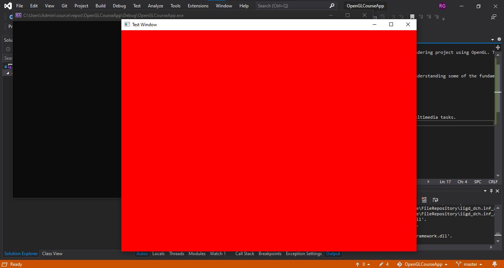
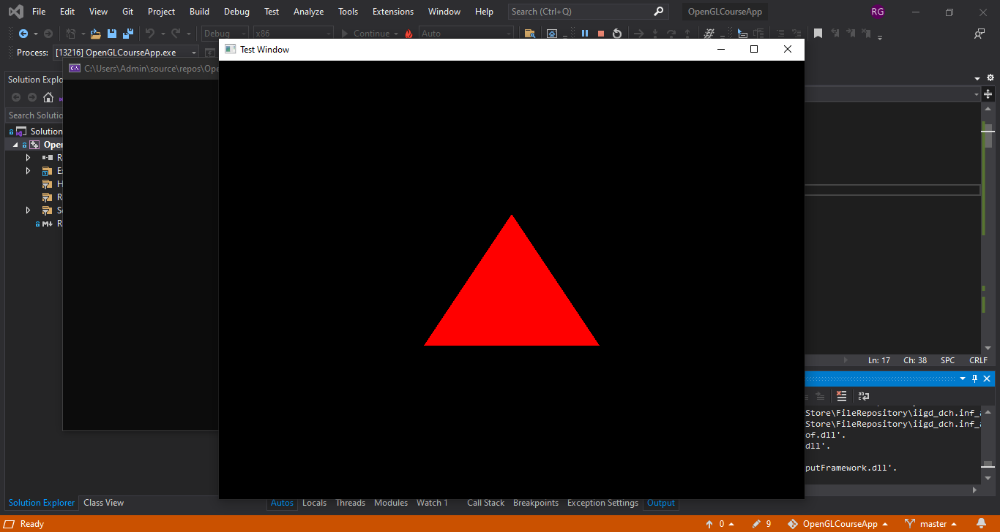
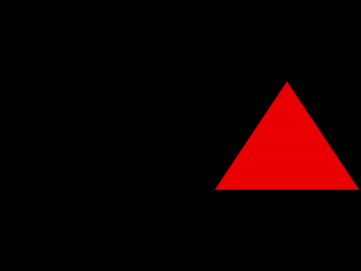

# 3D Rendering

## Overview

Welcome to the 3D Rendering Progress repository! This repository tracks the development of a 3D rendering project using OpenGL. The primary goal is to demonstrate the learning and progress made over time in creating and manipulating 3D graphics. 

### Day 1

Today marks the first day of this project. The focus was on setting up the basic environment and understanding some of the fundamental components involved in 3D rendering. 

## Concepts Covered

1. **Introduction to Libraries**
   - **GLEW (OpenGL Extension Wrangler Library):** A library used to manage OpenGL extensions.
   - **GLFW:** A library for creating windows and handling input.
   - **SDL (Simple DirectMedia Layer):** Another library for managing graphics, input, and other multimedia tasks.

2. **Coding Tasks**
   - **Setup Basic OpenGL Environment:** 
     - Initialized GLFW and set up a window with OpenGL context.
     - Integrated GLEW for managing OpenGL extensions.

   - **Shader Setup and Buffer Management:**
     - Created a basic vertex and fragment shader (commented out for now).
     - Set up vertex array object (VAO) and vertex buffer object (VBO) (commented out for now).

   - **Rendering Loop:**
     - Implemented a rendering loop that clears the window to a red color.
     - Set up for future inclusion of drawing objects and using shaders.

### Day 2

On Day 2, the focus was on understanding shaders and the rendering pipeline in OpenGL. In addition to theoretical concepts, practical aspects of creating and using shaders were explored.

## Concepts Covered

1. **Introduction to Shaders**
   - Shaders are small programs that run on the GPU to control how vertices and fragments are processed.
   - The two primary shaders covered today are the **Vertex Shader** and **Fragment Shader**.

2. **Rendering Pipeline**  
   The OpenGL rendering pipeline was broken down into multiple stages:
   - **Vertex Specification**: Defining the shape and form of objects using vertices.
   - **Vertex Shader**: The first programmable stage, transforming vertices and processing per-vertex data.
   - **Tessellation**: Dividing geometry into smaller patches (optional stage).
   - **Geometry Shader**: Modifies geometry (optional stage), can generate new vertices.
   - **Vertex Post-Processing**: Processing vertices after the vertex shader, preparing for assembly.
   - **Primitive Assembly**: Grouping vertices into geometric shapes like points, lines, or triangles.
   - **Rasterization**: Converting primitives into fragments, which represent potential pixels.
   - **Fragment Shader**: Determines the color and other attributes of each fragment.
   - **Per-Sample Operations**: Final steps in determining the final pixel colors, including depth testing, stencil testing, and blending.

3. **Creating VAO/VBO**  
   - **Vertex Array Object (VAO)** and **Vertex Buffer Object (VBO)** were introduced for managing vertex data efficiently.
   - VAOs store the state of vertex attribute arrays, while VBOs hold vertex data.

4. **Origins of Shader**
   - Explored how shaders have evolved from fixed-function pipeline operations to fully programmable pipeline components.
   - Shaders allow more control over how objects are rendered on the screen.

5. **Creating a Shader Program**
   - The process of writing shader code, compiling shaders, and linking them into a shader program was covered.
   - Shader programs are essential to apply the behavior defined in vertex and fragment shaders.

6. **Using a Shader Program**
   - Finally, we learned how to bind and use the shader program within the rendering loop.
   - This allows the GPU to use custom shaders to process vertices and fragments for rendering the scene.

## Code Progress
In the Day 2 code, I have:
- **Implemented and compiled a basic shader program** including a **vertex shader** and **fragment shader**.
- Created and configured a **Vertex Array Object (VAO)** and **Vertex Buffer Object (VBO)** to manage vertex data.
- Used the shader program within the rendering loop to prepare for drawing triangles and other shapes.
- Prepared the pipeline to render actual objects with custom shaders, setting up the groundwork for further rendering steps.

### Day 3

On **Day 3**, we focused on the math behind rendering, specifically dealing with vectors, matrices, and uniform variables in OpenGL. These are essential for transformations and rendering complex scenes.

## Concepts Covered
1. **Introduction to Vectors**
   - Vectors are fundamental in graphics programming for representing points, directions, and more.
   - Discussed vector representation in 2D and 3D space.

2. **Vector Operations**
   - Operations like addition, subtraction, dot product, and cross product were covered.
   - These are important for calculating normals, lighting, and object movement.

3. **Matrix Introduction and Operations**
   - Matrices are used to represent transformations like rotation, scaling, and translation.
   - Basic matrix operations such as multiplication were covered to combine transformations.

4. **Matrix Transforms**
   - Explored the use of matrices to transform objects in a 3D space.
   - Transformations covered:
     - **Translation**: Moving an object from one place to another.
     - **Scaling**: Changing the size of an object.
     - **Rotation**: Rotating objects around an axis.
     - **Combination of Transformations**: Combining translation, rotation, and scaling to achieve complex movements.

5. **OpenGL Math Library**
   - Introduction to OpenGL math libraries like **GLM** for handling vector and matrix operations easily within OpenGL.

6. **Uniform Variables**
   - **Uniform variables** allow for passing data (such as transformation values) from the CPU to the GPU.
   - In this code, a uniform variable (`xMove`) is used to move a triangle along the x-axis in the shader, creating dynamic movement.

## Code Progress

- A **uniform variable** was introduced to allow dynamic control over the x-axis movement of a triangle.
- The shader program was extended to accept the `xMove` uniform variable and apply it to the triangle's vertex positions.
- The triangle moves smoothly left and right across the screen in a loop, demonstrating how uniform variables can control transformations in real time.

